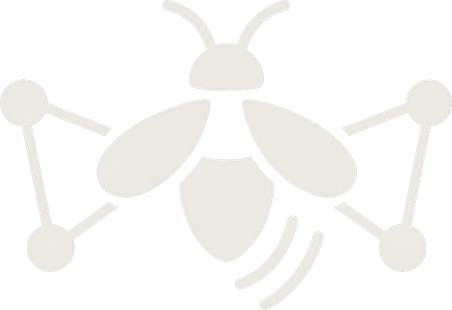

<p align="center">
  
</p>

# Firefly

A real-time web-based chat application for Meshtastic mesh networks. Features node discovery, profile management, and persistent message storage with an intuitive web interface.


## Features

- **Real-time Chat**: Send and receive messages instantly across the Meshtastic network
- **Meshtastic Integration**: Connect to Meshtastic mesh networks via UDP multicast
- **Node Discovery**: Automatically discover and track nodes on the mesh network
- **User Profiles**: Create, edit, and manage multiple Meshtastic profiles
- **Database Storage**: Persistent storage of seen nodes and message history per profile
- **Web Interface**: Clean, responsive web interface built with Bootstrap
- **Real-time Updates**: WebSocket integration for instant message and node discovery
- **Detailed Node Information**: View hardware details, roles, and connection statistics

## Requirements

### Native Installation
- Python 3.7+
- Modern web browser with WebSocket support
- Local network access

### Docker Installation (Recommended)
- Docker and Docker Compose
- Modern web browser with WebSocket support
- Local network access

## Installation

### Option 1: Docker (Recommended)

The easiest way to run Firefly is using Docker:

1. **Clone the repository**
   ```bash
   git clone https://github.com/pdxlocations/firefly.git
   cd firefly
   ```

2. **Optional: Configure environment**
   ```bash
   cp .env.example .env
   # Edit .env file if you want to customize settings
   ```

3. **Build and run with Docker Compose**
   ```bash
   docker-compose up --build
   ```

4. **Access the application**
   - Open your browser to `http://localhost:5011`
   - The application will be ready to use!

### Option 2: Native Python Installation

1. **Clone or download this project**
   ```bash
   git clone https://github.com/pdxlocations/firefly.git
   cd firefly
   ```

2. **Create a virtual environment (recommended)**
   ```bash
   python3 -m venv .venv
   source .venv/bin/activate  # On Windows: venv\Scripts\activate
   ```

3. **Install dependencies**
   ```bash
   pip install -r requirements.txt
   ```

## Usage

### Starting the Application

#### Docker Method (Recommended)

1. **Start the application**
   ```bash
   docker-compose up
   ```
   Use `docker-compose up -d` to run in the background.

2. **Open your web browser**
   - Navigate to `http://localhost:5011`
   - Or access from other devices on the network using your computer's IP address: `http://YOUR_IP:5011`

#### Native Python Method

1. **Run the application**
   ```bash
   python start.py
   ```
   You can also run app.py directly for testing, but start.py is the recommended entry point.

2. **Open your web browser**
   - Navigate to `http://localhost:5011`
   - Or access from other devices on the network using your computer's IP address: `http://YOUR_IP:5011`

### Using the Application

1. **Create a Meshtastic Profile**
   - Go to the "Profiles" page
   - Click "Create New Profile"
   - Fill in your Meshtastic node details:
     - **Node ID**: Your Meshtastic node ID (e.g., !deadbeef)
     - **Long Name**: Full display name for your node
     - **Short Name**: Short identifier (4 chars max)
     - **Channel**: Meshtastic channel name
     - **Key**: Encryption key for the channel
   - Click "Create Profile"

2. **Select Your Profile**
   - Return to the "Chat" page
   - Select your profile from the dropdown
   - Click "Set Profile"

3. **Start Using the Network**
   - **Chat**: Type messages to communicate with other nodes
   - **View Nodes**: Check the "Nodes" page to see discovered mesh nodes
   - **Monitor Activity**: Watch real-time updates as nodes join and send messages

### Multiple Instances

To chat with others on your network:

1. Each person should run the application on their device
2. Everyone should be connected to the same local network
3. Each person needs to create their own profile
4. Messages will be automatically shared between all running instances

## Pages and Features

### Chat Page
- Real-time messaging with other Meshtastic nodes
- Profile selection and management
- Connection status monitoring
- Quick overview of recently seen nodes

### Nodes Page
- Comprehensive list of all discovered mesh nodes
- Detailed node information including:
  - Hardware model and role
  - First/last seen timestamps
  - Packet counts and signal information
  - MAC addresses and public keys
- Interactive node details modal
- Statistics overview

### Profiles Page
- Create, edit, and delete Meshtastic profiles
- Configure node ID, names, channel, and encryption key
- Switch between different profiles

## Configuration

### Docker Configuration

Configure Firefly using environment variables in `.env` file:

- **FIREFLY_WEB_PORT**: Web interface port (default: 5011)
- **FIREFLY_UDP_PORT**: UDP multicast port (default: 4403)
- **FIREFLY_SECRET_KEY**: Flask secret key (change in production!)
- **FIREFLY_DEBUG**: Enable debug mode (default: false)
- **FIREFLY_NAME**: Application name displayed in UI (default: Firefly)

### Native Installation Configuration

You can modify these settings in `app.py`:

- **MCAST_GRP**: Default is 224.0.0.69 (multicast group address)
- **MCAST_PORT**: Default is 4403 (UDP multicast port)
- **Flask port**: Default is 5011 (change in app.py)
- **Database**: SQLite database stored as `firefly.db`

## Network Requirements

- Connection to a Meshtastic network via UDP multicast
- UDP multicast port 4403 must be available and not blocked by firewalls
- For best results, ensure your network allows UDP multicast traffic
- Compatible with MUDP (Meshtastic UDP) protocol implementations

## File Structure

```
firefly/
├── app.py              # Main Flask application
├── database.py         # Database models and operations
├── encryption.py       # Meshtastic encryption/decryption
├── requirements.txt    # Python dependencies
├── firefly.db         # SQLite database (created automatically)
├── templates/
│   ├── base.html      # Base template with navigation
│   ├── index.html     # Chat interface
│   ├── nodes.html     # Node discovery and details
│   └── profiles.html  # Profile management
└── static/
    ├── css/
    │   └── style.css  # Custom styles
    ├── js/
    │   └── app.js     # JavaScript utilities
    └── images/
        ├── firefly-logo-dark.png   # Logo for dark theme
        └── firefly-logo-light.png  # Logo for light theme
```

## Docker Management

### Useful Docker Commands

```bash
# View logs
docker-compose logs -f

# Restart the application
docker-compose restart

# Stop the application
docker-compose down

# Update and rebuild
docker-compose up --build

# Access container shell
docker-compose exec firefly /bin/bash
```

### Data Persistence (Docker)

- Application data is stored in Docker volume `firefly_data`
- Database and profiles persist between container restarts
- To backup data:
  ```bash
  docker run --rm -v firefly_data:/data -v $(pwd):/backup alpine tar czf /backup/firefly-backup.tar.gz -C /data .
  ```

## Troubleshooting

### Docker Issues

#### Container Won't Start
1. Check logs: `docker-compose logs firefly`
2. Verify port availability: `netstat -tulpn | grep :5011`
3. Check disk space: `df -h`

#### UDP Communication Issues (Docker)
1. Verify UDP port 4403 is not blocked by firewall
2. Test UDP connectivity: `nc -u localhost 4403`
3. Check Meshtastic device configuration
4. Ensure Docker container can access host network for UDP multicast

### General Issues

#### Port Already in Use
If you get a "port already in use" error:
1. **Docker**: Change `FIREFLY_WEB_PORT` in `.env` file
2. **Native**: Change the MCAST_PORT in `app.py` to a different number
3. Restart the application
4. Make sure all users use the same port number

#### No Messages Received
1. Check that all devices are on the same network
2. Verify that UDP port 4403 is not blocked by firewall
3. Try disabling firewall temporarily for testing
4. Check that the application is running on all devices
5. **Docker**: Ensure container networking allows UDP multicast

#### Web Interface Not Loading
1. Make sure the application is running (check logs)
2. Try accessing via `http://127.0.0.1:5011` instead of localhost
3. Check that port 5011 is not blocked
4. **Docker**: Use `docker-compose logs` to check for errors

#### Profile Issues
1. Profiles are stored in SQLite database - this is created automatically
2. If you have profile issues, you can delete the database and restart
3. Make sure you select a profile before trying to send messages
4. **Docker**: Database is in the `firefly_data` volume

## Technical Details

- **Backend**: Python Flask with Flask-SocketIO
- **Database**: SQLite for persistent data storage
- **Frontend**: HTML5, CSS3, JavaScript (ES6+)
- **Real-time**: WebSocket connections for instant updates
- **Networking**: Meshtastic MUDP protocol over UDP multicast
- **Mesh Integration**: Direct integration with Meshtastic protobuf messages
- **Node Discovery**: Automatic NODEINFO_APP packet processing
- **Threading**: Flask-SocketIO uses the threading backend, and UDPPacketStream runs a background listener thread for receiving packets
- **Data Storage**: Profiles, nodes, and messages are stored per-profile in SQLite database
- **Profile Persistence**: Profiles survive application restarts and are safely migrated from JSON

## Data Persistence

- **Profile Storage**: All profiles are stored in `firefly.db` SQLite database
- **Automatic Migration**: Existing `profiles.json` files are automatically migrated on first run
- **Persistent Data**: Profiles, nodes, and messages survive application restarts
- **Safe Migration**: Migration only occurs once when database is empty
- **Backup Protection**: Original JSON files are preserved as `.migrated` backups

## Docker vs Native Installation

### Advantages of Docker
- **Easy Setup**: No need to install Python dependencies
- **Consistent Environment**: Runs the same on any system with Docker
- **Isolation**: Doesn't interfere with system Python packages
- **Data Persistence**: Automatic volume management for database
- **Production Ready**: Easy deployment and scaling
- **Quick Updates**: Simple container rebuilding

### When to Use Native Installation
- **Development**: When modifying the code
- **Resource Constraints**: Lower overhead without container layer
- **Integration**: When integrating with existing Python environments

For detailed Docker usage, see [DOCKER.md](DOCKER.md).

## Security Considerations

- This application integrates with Meshtastic mesh networks
- Uses Meshtastic's built-in AES encryption for message security
- Node information and messages are stored locally in SQLite database
- Database contains channel encryption keys - protect the database file
- Web interface runs on localhost by default (configure as needed)
- Consider firewall rules if exposing the web interface beyond localhost
- **Docker**: Change `FIREFLY_SECRET_KEY` in production deployments

## License
This project is provided as-is for educational and personal use.

Meshtastic® is a registered trademark of Meshtastic LLC. Meshtastic software components are released under various licenses, see GitHub for details. No warranty is provided - use at your own risk.

